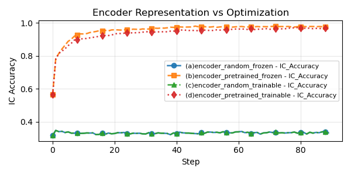

*Figure.* ICL accuracy across encoder conditions. We compare models using pretrained versus randomly initialized encoders, where the encoder is either frozen or updated during multimodal training.
The gap between (b) and (a) highlights the significant gain brought by higher representation quality. The persistent gap between (c) and (d) after convergence demonstrates that random initialization cannot match pretrained performance, proving that optimization ease is not the main reason.