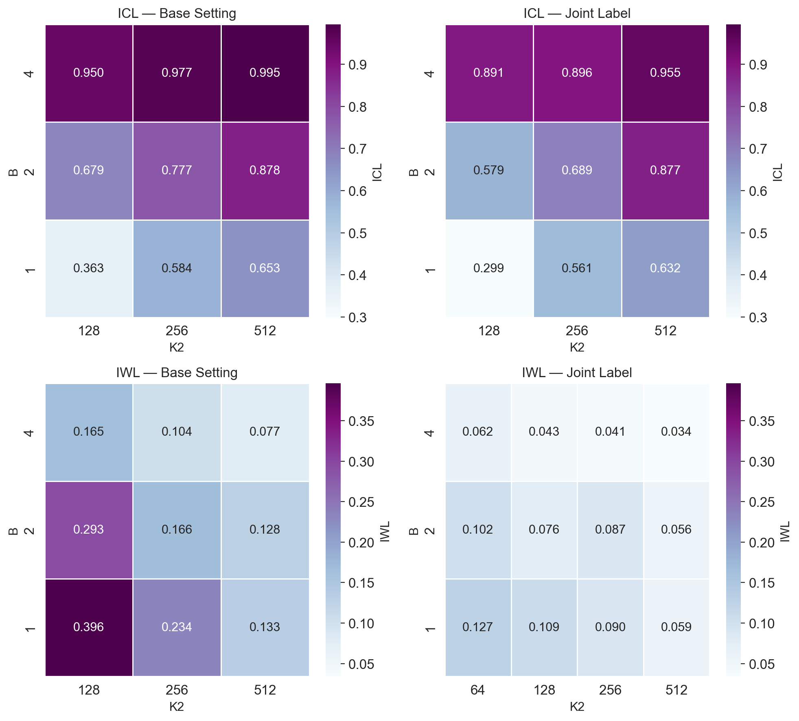

<figure style="width: 720px; margin: 0;">
  
  <figcaption style="width: 100%; font-style: italic;">
    <b>Figure.</b> The ICL and IWL accuracy in the base setting (shared label) and joint label setting. Here we fix \(K_1=8192\). In both setting we can observe the asymmetry. In the joint label setting, the asymmetry is weaker due to the increased ICL pressure but still persists.
  </figcaption>
</figure>