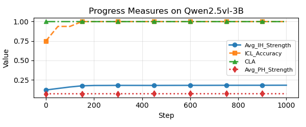

*Figure.* The average previous token head strength, induction head strength, CLA and ICL accuracy during Qwen2.5-vl-3B finetuning on Open-MI dataset. CLA remain at the ceiling from the start. 
With the increase of ICL accuracy, the average previous token head strength remain stable while the average induction head strength increase significantly. These results mirror the findings in our synthetic setting.