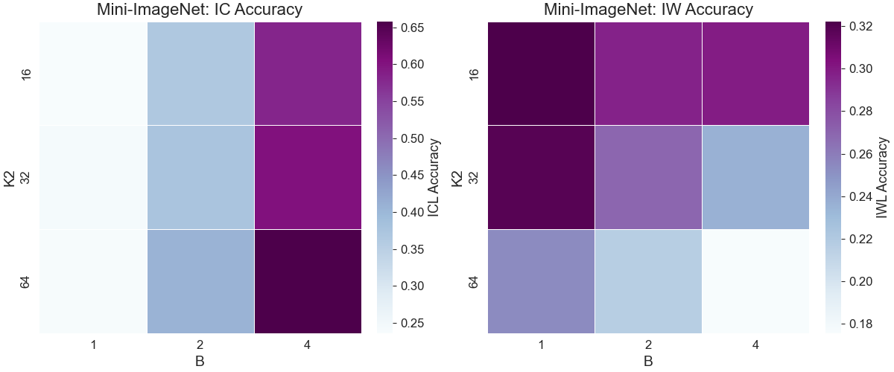

<figure style="width: 720px; margin: 0;">
  
  <figcaption style="width: 100%; font-style: italic;">
    <b>Figure.</b> The ICL accuracy and IWL accuracy using Mini-imagenet training set (64 classes) as the second modality. We first pretain a ViT-small encoder on Mini-ImageNet, freeze it and then train a projector and a pretrained decoder along with it. Here we fix \(K_1=8192\), sweep \(K_2 \in \{16,32,64\}\) and \(B \in \{1,2,4\}\). Given the complexity of the images, the asymmetry still persists.
  </figcaption>
</figure>