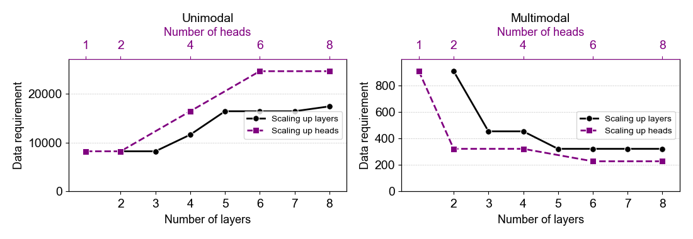

<figure style="width: 720px; margin: 0;">
  
  <figcaption style="width: 100%; font-style: italic;">
    <b>Figure.</b> In the unimodal and multimodal setting, scaling up model layers and heads both increase the data complexity requirement for high ICL (&ge; 0.95) while scaling up heads increases such requirement more.
  </figcaption>
</figure>